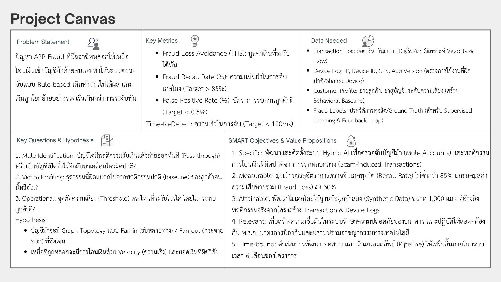

## 🛡️ Project IronShield: Intelligent System for Mule Account Detection
Welcome to **Project IronShield**. Our mission is to safeguard the banking ecosystem against the threats of APP Fraud (Authorized Push Payment Fraud) and Mule Account Networks by applying Advanced Behavioral Analytics and proactive detection strategies, ensuring superior security across all transactions.

## 🚀 Business Context
The issue of **APP Fraud (Authorized Push Payment Fraud)** has become increasingly severe. Fraudsters exploit **Mule Accounts** as the primary mechanism to rapidly move funds out of the system—often within just a few minutes.

Traditional **rule-based detection systems** face limitations such as delays and low detection rates, making them ineffective in stopping fraudulent transactions in time. **Project IronShield** was developed to leverage **Behavioral Analytics** and **Real-time Detection** to identify abnormal transaction patterns and flag mule-like behaviors. The focus is on reducing **fraud losses** while maintaining a balanced **false positive** rate to avoid disrupting legitimate users.

## 🎯Objectives
* Develop a Machine Learning Model to detect and classify mule accounts based on abnormal transaction behaviors.
* Enhance real-time detection efficiency with low latency processing.
* Establish a Behavioral Baseline to distinguish normal users from high-risk behavioral groups.
* Minimize fraud losses by promptly blocking transactions in high-risk zones.

## 🎯 SMART Objectives
* **Detection Rate (Recall Rate):** Identify suspected mule accounts with accuracy above 85%.
* **Loss Mitigation:** Reduce potential financial losses by 30% within the first six months of system deployment.
* **Operational Efficiency:** Cut manual investigation time by 40% through automated screening and High-Risk Tagging.

## 🖼️ Project Canvas
The overall project can be summarized in a Project Canvas as illustrated below.

## Dataset Overview
This project simulates a realistic banking transaction environment for detecting suspicious mule account behavior and scam-induced transactions.
The dataset is designed using a relational schema consisting of 8 interconnected tables, allowing behavioral, temporal, and risk-based analysis.

The primary objective of the dataset is to support:

* Exploratory Data Analysis (EDA)
* Transaction velocity analysis
* Mule account behavior detection
* Fraud investigation simulation
* Future machine learning development

## Dataset Structure
### 1. transaction_log
**Purpose:**

The core transactional table used to analyze money movement behavior and identify suspicious transaction patterns.

**Data Dictionary**
| Column Name             | Data Type | Description                                  |
| ----------------------- | --------- | -------------------------------------------- |
| `transaction_id`        | String    | Unique identifier for each transaction       |
| `sender_account_id`     | String    | Account ID of the sender                     |
| `receiver_account_id`   | String    | Account ID of the receiver                   |
| `receiver_bank_code`    | String    | Receiving bank identifier                    |
| `amount`                | Float     | Transaction amount                           |
| `transaction_timestamp` | Datetime  | Date and time of the transaction             |
| `transaction_type`      | String    | Type of transaction                          |
| `channel_id`            | String    | Transaction channel                          |
| `promptpay_id`          | String    | PromptPay number associated with transaction |
| `is_high_risk_flag`     | Boolean   | Risk flag indicating suspicious activity     |
| `Time_Gap_Minutes`      | Integer   | Time difference between transactions         |
| `Final_Status`          | String    | Final classification status                  |

### 2. account_master
**Purpose:**

Stores banking account information associated with each customer.

**Data Dictionary**
| Column Name      | Data Type | Description                    |
| ---------------- | --------- | ------------------------------ |
| `account_id`     | String    | Unique account identifier      |
| `customer_id`    | String    | Linked customer identifier     |
| `open_date`      | Date      | Account opening date           |
| `account_type`   | String    | Type of bank account           |
| `account_status` | String    | Current status of the account  |
| `daily_limit`    | Integer   | Daily transaction limit amount |

### 3. customer_profile
**Purpose:**

Contains demographic and customer-level profile information.

**Data Dictionary**
| Column Name        | Data Type | Description                  |
| ------------------ | --------- | ---------------------------- |
| `customer_id`      | String    | Unique customer identifier   |
| `risk_level`       | String    | Customer risk classification |
| `occupation`       | String    | Customer occupation          |
| `monthly_income`   | Integer   | Monthly income amount        |
| `age`              | Integer   | Customer age                 |
| `address_province` | String    | Customer province/location   |

### 4. session_device_log
**Purpose:**

Captures device and session-related behavioral signals during transactions.

**Data Dictionary**
| Column Name            | Data Type | Description                                             |
| ---------------------- | --------- | ------------------------------------------------------- |
| `session_id`           | String    | Unique session identifier                               |
| `customer_id`          | String    | Linked customer identifier                              |
| `device_id`            | String    | Unique device identifier                                |
| `ip_address`           | String    | Device IP address                                       |
| `gps_location`         | String    | GPS coordinates of device location                      |
| `app_version`          | String    | Mobile banking application version                      |
| `is_rooted_jailbroken` | Boolean   | Indicates whether device is rooted or jailbroken        |
| `remote_app_detected`  | Boolean   | Indicates whether remote access application is detected |
| `battery_level`        | Integer   | Device battery percentage                               |
| `biometric_score`      | Float     | Biometric authentication confidence score               |

#### 5. fraud_case_management
**Purpose:**

Represents fraud investigation outcomes and response actions generated from suspicious transactions.

**Data Dictionary**
| Column Name                     | Data Type | Description                                |
| ------------------------------- | --------- | ------------------------------------------ |
| `case_id`                       | String    | Unique fraud investigation case identifier |
| `alert_id`                      | String    | Unique alert identifier                    |
| `related_transaction_id`        | String    | Linked suspicious transaction ID           |
| `alert_timestamp`               | Datetime  | Timestamp when fraud alert was triggered   |
| `action_timestamp`              | Datetime  | Timestamp of fraud response action         |
| `system_action`                 | String    | Action taken by fraud detection system     |
| `is_hold_applied`               | Boolean   | Indicates whether account hold was applied |
| `hold_duration_minutes`         | Integer   | Duration of account hold in minutes        |
| `customer_response_during_hold` | String    | Customer response during hold period       |
| `final_status`                  | String    | Final fraud investigation result           |
| `fraud_type`                    | String    | Type/category of fraud                     |
| `financial_impact`              | Float     | Estimated financial loss amount            |
| `customer_feedback`             | String    | Customer feedback or scam report           |

#### 6. external_blacklist
**Purpose:**

Simulates external high-risk account and blacklist intelligence sources.

**Data Dictionary**
| Column Name      | Data Type | Description                            |
| ---------------- | --------- | -------------------------------------- |
| `id_card_hash`   | String    | Masked or hashed national ID reference |
| `account_number` | String    | Blacklisted bank account number        |
| `source`         | String    | Source of blacklist information        |
| `added_date`     | Datetime  | Date and time added to blacklist       |

#### 7. call_center_logs
**Purpose:**

Stores customer interactions with the call center related to suspicious transactions, account verification, or scam reporting.

**Data Dictionary**
| Column Name              | Data Type | Description                           |
| ------------------------ | --------- | ------------------------------------- |
| `call_id`                | String    | Unique identifier for each call       |
| `customer_id`            | String    | Linked customer identifier            |
| `call_timestamp`         | Datetime  | Date and time of the call             |
| `call_reason`            | String    | Reason for contacting the call center |
| `call_duration_minutes`  | Integer   | Duration of the call in minutes       |
| `agent_action`           | String    | Action taken by call center agent     |
| `call_outcome`           | String    | Final outcome of the interaction      |
| `related_transaction_id` | String    | Related suspicious transaction ID     |
| `scam_reported_flag`     | Boolean   | Indicates whether scam was reported   |
### 8. app_ui_logs
**Purpose:**

Captures user interaction behavior within the mobile banking application interface.

**Data Dictionary**
| Column Name              | Data Type | Description                          |
| ------------------------ | --------- | ------------------------------------ |
| `log_id`                 | String    | Unique UI log identifier             |
| `customer_id`            | String    | Linked customer identifier           |
| `session_id`             | String    | Associated session identifier        |
| `event_timestamp`        | Datetime  | Timestamp of user interaction        |
| `screen_name`            | String    | Application screen/page name         |
| `button_clicked`         | String    | Button or UI element interacted with |
| `time_spent_seconds`     | Integer   | Time spent on the screen             |
| `navigation_sequence`    | String    | User navigation path within the app  |
| `abnormal_behavior_flag` | Boolean   | Indicates suspicious UI behavior     |

## Data Preprocessing

Data preprocessing was performed using Power Query to validate data quality and ensure consistency before analysis.
The preprocessing process focused on logical validation and data standardization while preserving suspicious behavioral patterns related to mule accounts.
Preprocessing Steps
### 1. Data Type Validation
* Verified that each column had the correct data type
* Examples:
  * `transaction_timestamp` → Datetime
  * `amount` → Numeric
  * `age` → Integer
  * `is_high_risk_flag` → Boolean

This ensures accurate calculations, filtering, and time-series analysis.

### 2. Duplicate Column Check
Checked for duplicated or redundant columns after importing data into Power Query
Ensured that all attributes were uniquely defined and correctly mapped
### 3. Date and Time Standardization
* Identified formatting inconsistencies in date-related columns

Example:

* `open_date` in `account_master` contained unnecessary time values such as `00:00:00`
* Since account opening records only require the date component, the column was split and the time portion was removed

This improves data consistency and avoids misleading temporal analysis.

### 4. Duplicate Row Validation
* Checked for duplicated records across tables
* Ensured that primary identifiers such as:
  * transaction_id
  * account_id
  * case_id

remain unique

### 5. Data Range and Logical Validation
Validated whether numerical values fall within realistic and acceptable ranges

Examples:

* `age` should remain within a logical human age range
* `battery_level` should be between 0–100
* `biometric_score` should remain between 0–1
* Transaction amounts should not contain impossible negative values
### 6. Preservation of Suspicious Patterns
* Abnormal or suspicious behavioral patterns were not removed during preprocessing
* Instead of deleting unusual transactions, records were preserved for behavioral analysis related to mule account detection

This is important because high-frequency or unusual transactions may represent meaningful fraud signals rather than data errors.

## Preprocessing Outcome

The final dataset is:

* Structurally consistent
* Logically validated
* Free from major formatting issues
* Suitable for behavioral analysis and visualization
* Ready for future machine learning development and fraud detection tasks

# Exploratory Data Analysis (EDA) using 5W1H Framework

To better understand mule account behavior and fraudulent transaction patterns, we conducted Exploratory Data Analysis (EDA) using the **5W1H framework**.  
This approach helps identify suspicious behavioral patterns from multiple perspectives: **Who, What, When, and How**.

---

## WHO — Who are the suspicious accounts?

### Objective
Identify accounts with unusually high transaction velocity.

### Visualization
**Top Accounts by Velocity**

### Key Findings
- Several accounts showed significantly higher transaction frequencies than the dataset average.
- High-velocity accounts are potential **mule accounts**, which are commonly used to rapidly receive and transfer money.
- After combining transaction data with customer profiles:
  - **Employees** and **Students** appeared frequently among high-velocity accounts.
  - This suggests that ordinary user accounts can potentially be exploited as temporary financial intermediaries.

### Insight
Mule accounts often demonstrate:
- High transaction frequency
- Repeated transfer behavior
- Rapid movement of funds

---

## WHAT — What transaction types are most risky?

### Objective
Determine which transaction types are associated with the highest fraud rate.

### Visualization
**Transaction Type vs Fraud Rate**

### Key Findings
| Transaction Type | Fraud Rate |
|------------------|------------|
| Transfer         | ~46%       |
| QR Payment       | ~29%       |
| Top-up           | ~15%       |
| Bill Payment     | ~10%       |

### Insight
- **Transfer** transactions had the highest fraud rate.
- **QR payments** also showed elevated fraud activity.
- These transaction channels are commonly used because they:
  - Enable fast fund movement
  - Are difficult to trace in real time
  - Support quick pass-through behavior

---

## WHEN — When does fraud activity occur?

### Objective
Analyze temporal transaction patterns and detect burst/spike behaviors.

### Visualization
**Spike/Burst Time Series Analysis**

### Key Findings
- Fraud transactions did not occur randomly.
- Suspicious activities appeared in concentrated bursts during specific periods.
- Multiple transactions were often executed within very short time windows.

### Insight
This behavior reflects a common mule-account strategy:
- Receive money
- Quickly transfer funds onward
- Reduce the risk of account freezing or detection

---

## HOW — How does the fraud behavior operate?

### Objective
Understand how mule accounts move money through the banking system.

### Visualization
- Inflow vs Outflow Time Gap
- Victim Profiling: Amount Distribution

### Key Findings

#### Pass-Through Behavior
- Most fraud transactions occurred within the **Pass-Through Zone (< 60 minutes)**.
- Fraud accounts tended to transfer money out almost immediately after receiving funds.
- This indicates that mule accounts act as temporary transit accounts rather than storing money.

#### Amount Distribution
- Fraud transactions generally had a higher median transaction amount than normal transactions.
- However, there was still significant overlap between normal and fraud transaction amounts.
- Some legitimate users also performed high-value transactions.

### Insight
Using only transaction amount thresholds is not sufficient for fraud detection.

Effective mule-account detection should combine multiple behavioral signals, such as:
- Transaction Velocity
- Inflow-Outflow Time Gap
- Transaction Channel
- Transfer Patterns

### Business Interpretation
The analysis suggests that mule accounts exhibit:
- High-speed money movement
- Pass-through fund behavior
- Rapid transaction chaining

These behavioral patterns can support:
- Auto-hold mechanisms
- Real-time fraud alerts
- Risk scoring systems

# Error Analysis

After conducting exploratory data analysis (EDA), several limitations and risk patterns were identified.  
These findings highlight challenges in mule-account detection and suggest possible improvements for future systems.

| Imperfection / Observation | Impact | Next Step |
|---|---|---|
| `is_high_risk_flag` still produced false negatives (FN) in some cases | Some suspicious accounts bypassed rule-based detection | Replace single-rule detection with **behavioral scoring models** |
| Transaction amount overlap existed between Normal and Fraud cases | Fixed thresholds alone cannot reliably separate fraud from legitimate transactions | Use **composite scoring** combining amount, velocity, channel, and behavioral features |
| Some fraud cases used low-to-medium transaction amounts (10k–80k) | Stealth / micro-structuring behavior becomes difficult to detect | Add **velocity analysis** and **pattern-based alerting** |
| Certain fraud cases still resulted in financial loss despite hold mechanisms | Victims sometimes confirmed transactions themselves | Introduce **delay mechanisms**, outbound verification calls, or adaptive hold policies |
| Real-time fraud detection architecture remains complex | Stream processing and low-latency scoring require higher infrastructure resources | Implement scalable streaming pipelines such as **Kafka → Stream Processing → Risk Scoring → Auto Blocking** |

---

## Key Insight

The analysis suggests that mule-account detection should not rely on:
- Single flags
- Static thresholds
- Amount-based rules alone

Instead, effective fraud detection should incorporate:
- Behavioral analytics
- Velocity patterns
- Pass-through behavior
- Composite risk scoring
- Real-time event processing

This reflects real-world fraud systems, where suspicious behavior is identified through combinations of signals rather than a single condition.

These insights help support the development of more accurate fraud and mule-account detection systems.
## 🚀 Next Steps & Recommendations

### 1. Develop a Composite Risk Scoring Model
Transition from a binary static flag to a **Composite Risk Score**. By integrating multiple features—such as *Time Gap, Transaction Amount, Channel,* and *Transaction Type*—the system can more accurately distinguish between legitimate high-value users and fraudulent activity.

### 2. Implement Micro-structuring Detection
Implement automated alerts for **"Smurfing" or Micro-structuring patterns**. This involves detecting multiple small-value transfers sent to the same destination account within a short timeframe to bypass fixed transaction thresholds.

### 3. Architect a Real-time Detection Pipeline
To combat the 60-minute "Pass-Through" window, a real-time infrastructure is required:
* **Ingestion:** Kafka to capture real-time transaction events.
* **Processing:** Stream processors to calculate features on the fly.
* **Inference:** A scoring model to evaluate risk and trigger an **Auto-block or Hold** status within a **<100ms** latency window.

### 4. Introduce Dynamic Friction for High-Risk Transactions
Apply "Strategic Friction" to high-stakes scenarios. For transactions where the Risk Score is high and the amount exceeds **500,000 Baht**, the system will implement a **30-minute delay** combined with a mandatory **outbound verification call** from staff.

### 5. Real-world Validation & Model Governance
As the current findings are based on **Synthetic Data**, the derived thresholds must be validated against actual bank production data. Furthermore, a retraining pipeline will be established to adapt to evolving fraud patterns.

## 📂 Repository Structure
* `/data`
* `/dashboard`
* `/documents`
